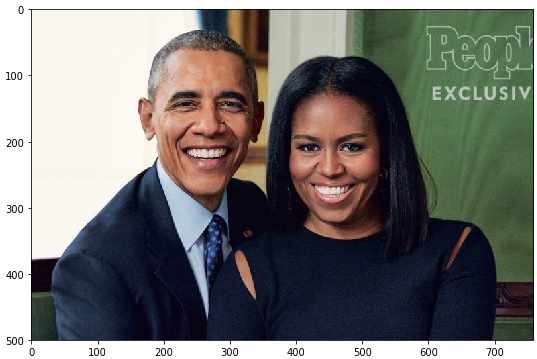
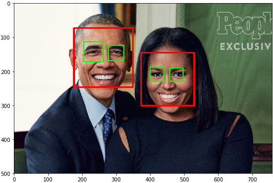
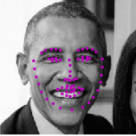
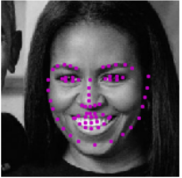

# Facial-Keypoints-Detection:
Detect the facial keypoints using a deep neural network.
The data-set is extracted from [the YouTube Faces Dataset](https://www.cs.tau.ac.il/~wolf/ytfaces/). These videos have been fed through some processing steps and turned into sets of image frames containing one face and the associated key-points.

### Network Architecture:

  | Layer Number |  Layer Name  |   Layer Shape  |   Parameters  |
  |:------------:|:------------:|:--------------:|:-------------:|
  |       1      |     Input    |  (1, 224, 224) |               |
  |       2      |   Conv2D_1   | (32, 220, 220) |      k=5      |
  |       3      |     ReLU     | (32, 220, 220) |               |
  |       4      |   Maxpool2D  |  (32, 73, 73)  |  k = 3, s = 3 |
  |       5      |   Dropout1   |  (32, 73, 73)  |    p = 0.1    |
  |       6      |   Conv2D_2   |  (64, 71, 71)  |     k = 3     |
  |       7      | Batch_norm2D |  (64, 71, 71)  |               |
  |       8      |     ReLU     |  (64, 71, 71)  |               |
  |       9      |   Maxpool2D  |  (64, 23, 23)  |  k = 3, s = 3 |  
  |      10      |   Dropout2   |  (64, 23, 23)  |    p = 0.2    |  
  |      11      |   Conv2d_3   |  (128, 21, 21) |     k = 3     |
  |      12      |     ReLU     |  (128, 21, 21) |               |  
  |      13      |   Maxpool2D  |   (128, 7, 7)  |  k = 3, s = 3 |  
  |      14      |   Dropout3   |   (128, 7, 7)  |     p = 0.3   |  
  |      15      |    Flatten   |     (6272)     |               |  
  |      16      |    Dense1    |      (512)     |               |  
  |      17      | Batch_norm1D |      (512)     |               |  
  |      18      |     ReLU     |      (512)     |               |  
  |      19      |    Dense2    |      (136)     |               |

* All convolutional layers parameters are initilazed using Kaiming Initialization method as it takes into account the non-linearity introduced by the ReLU activation function. Initialization in general is a way to steer clear of vanishing or exploding gradient and avoid all weights receiving the same gradient (Symmetry breaking).
* Dropout and Batch normalization layers are used to avoid overfitting. Batch normalization not only acts as regularizer but also accelerated the training and improved the performance significantly when introduced to the network.

### Preprocessing:
* The colored images are converted to grayscale images, as the color does not carry any valuable information, with a color range of [-1, 1].
* The images are rescaled to be 224 * 224 pixels images.
#### Training:
* The facial keypoints are normalized to be centered at 0 in range of [-1, 1].
* Random cropping before rescaling are introduced.

### Training:

* The network is trained for 35 epochs with 16 as the batch size.
* [Adam](https://arxiv.org/abs/1412.6980) is chosen as the optimizer with 0.001 learning rate.
* The loss function is the mean squared error(MSE) as it represents the euclidean distance between the ground truth and the predicted facial landmarks.

### Results:
* Test dataset:

  
  

  * green represents the ground truth facial keypoints.
  * magenta represents the predicted facial keypoints.

* Random image:

  * OpenCV's pre-trained Haar Cascade classifier is responsible for extracting faces from the image.

  * Original image:

    
  * Detected faces:

    
  * Facial keypoints of the first face:

    
  * Facial keypoints of the second face:

    

### Note:
This project is one of three projects accomplished in the Udacity computer vision Nanodegree program.
